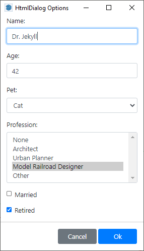

# Html Inputbox for SketchUp Ruby API

This example recreates the functionality of `UI.inputbox` using `UI::HtmlDialog`.

It uses [Vue.js](https://vuejs.org/) for data binding and [Bootstrap](https://getbootstrap.com/) for UI. Refer to the documentation for these frameworks for more details.



## Example Usage

### Simple example with similar calling signature as UI.inputbox

```ruby
  def self.prompt_without_options
    title = 'Tell me about yourself'
    prompts = ['What is your name?', 'What is your age?', 'Pet?']
    defaults = ['Enter name', 42, 'None']
    results = HtmlUI.inputbox(prompts, defaults, title)
    p results
  end
```

### Simple example with similar calling signature as UI.inputbox

```ruby
  def self.prompt_with_options
    title = 'Tell me about yourself'
    prompts = ['What is your Name?', 'What is your age?', 'Pet?']
    defaults = ['Enter name', 42, 'Cat']
    list = ['', '', 'None|Cat|Dog|Other']
    results = HtmlUI.inputbox(prompts, defaults, list, title)
    p results
  end
```

### Example of how more advanced inputs can be created

```ruby
  def self.prompt_advanced
    options = {
      title: 'HtmlDialog Options',
      accept_button: 'Ok',
      cancel_button: 'Cancel',
      inputs: [
        HtmlUI::Textbox.new('Name'),
        HtmlUI::Textbox.new('Age', 42),
        HtmlUI::Dropdown.new('Pet', 'Cat', [
          'None', 'Cat', 'Dog', 'Parrot (Resting)', 'Other'
        ]),
        HtmlUI::Listbox.new('Profession', 'Minion', [
          'None', 'Architect', 'Urban Planner', 'Model Railroad Designer', 'Other'
        ]),
      ]
    }
    dialog = HtmlUI::InputBox.new(options)
    results = dialog.prompt
    p results
  end
```
